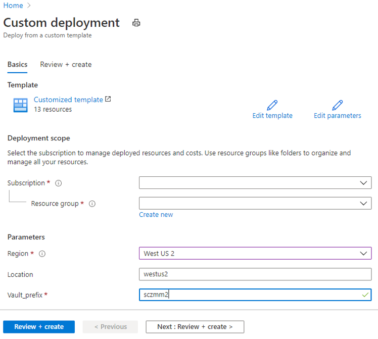
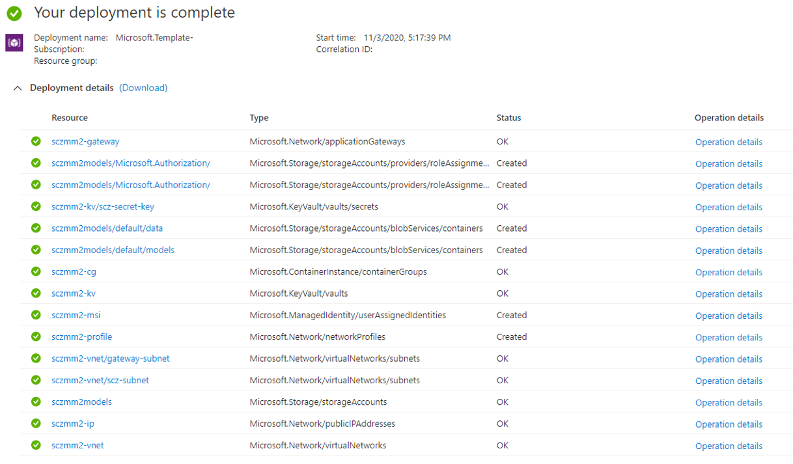

# Securing your AI model and data

Santa Cruz provides AI model protections [at rest](protection-at-rest.md), [during transition](protection-in-transition.md) and [in use](protection-in-use.md). It's designed to work with existing AI systems and workflows such as [Azure Machine Learning]( https://azure.microsoft.com/en-us/services/machine-learning/), [Azure Databricks]( https://azure.microsoft.com/en-us/services/databricks/), and [Azure Cognitive Services]( https://azure.microsoft.com/en-us/services/cognitive-services/). The long-term goal of Santa Cruz is to provide a unified experience across underlying systems. 

The Santa Cruz preview kit is shipped with a secured AI model locker and a Python SDK, as highlighted in the following diagram. The server provides secured key and model management capabilities. In the future the SDK will interact with device TPM and attestation service to prove device identity with the server to retrieve protected keys or models.


## Provision a new secured locker
A secured AI model locker relies on a number of Azure resources to operate. Please see [server topology](server-topology.md) for more details. We offer the automated scripts to provision your server instance on Azure.  

### Step 1. Provision SantaCruz AI/ML model and sensor data protection solution (TODO: change azuredeploy.json file location to the official path)
Press this button to deploy SantaCruz AI/ML model and sensor data protection solution to your Azure public cloud 

[](https://portal.azure.com/#create/Microsoft.Template/uri/https%3A%2F%2Fraw.githubusercontent.com%2FJiaBaoxi%2FPublicShare%2Fmaster%2Fazuredeploy.json)

This will redirect you to the Azure portal with this deployment page


To deploy solution in the cloud, enter the following parameters and click Review + Create:

Subscription = The subscription in which to create the solution
Resource Group = Unique name of a new resource group to host SantaCruz AI/ML model and sensor data protection solution solution components

Parameters

Region = Azure region in which solution will be deployed

Location = Location within the region 

Locker_prefix = Prefix to attach to new resource names

On the next page, click Create after agreeing to the terms and conditions.


The deployment may take several minutes to complete and should result in creation of Azure resources within the specified resource group.


### Step 2: Update deployment using PowerShell script

#### Prerequisites

We offer a PowerShell script for server deployment. To run the script, you need:

* [Git Bash](https://git-scm.com/downloads)
* [PowerShell](https://docs.microsoft.com/en-us/powershell/scripting/install/installing-powershell?view=powershell-7)
* [Azure PowerShell Module](https://docs.microsoft.com/en-us/powershell/azure/install-az-ps?view=azps-4.6.1)

#### Update server access

1. Clone this repository
   ```
   git clone https://github.com/microsoft/Project-Santa-Cruz-Preview.git
   cd Project-Santa-Cruz-Preview
   ```
2. Launch PowerShell
3. Run the deployment script:
   ```
   cd "Sample-Scripts-and-Notebooks/Official/Secured Locker/deployment"
   ./device_identity.ps1 -vaultName <Azure Key Vault instance name generated by provision step> -subscription <Azure subscription name or id>
   ```
   For example, the following script genernates a new Service Principal and grant it access to  ```scz-mm1-kv``` key vault instance under ```my-subscription``` subscription.

   ```
    ./device_identity.ps1 -vaultName scz-mm1-kv -subscription my-subscription
    ```
4. The script then prompts a web browser for you to log in to your Azure subscription. Login to your Azure account to continue.
5. Once the script finishes, it outputs the service principal that is granted access to the Azure Key Vault service. 

   ```
=======
   Santa Cruz Secred Model Management server is provisioned at:  ...
   Service Principal Client ID:     3f38...
   Service Principal Tenant ID:     72f9...
   Service Principal Client Secret: bf49...
   ```
   > **NOTE**: Write down the service principal credentials (Client ID, Tenant ID, Client Secret). You'll use it to login to the Santa Cruz server later.

### Step 3:  Add TLS certificate to Gateway

A secured AI model locker is deployed with an [Azure Application Gateway](https://docs.microsoft.com/en-us/azure/application-gateway/overview) as its entry point. By default, the Gateway is configured to serve an HTTP endpoint only. As we may need to pass decryption key to the client-side containers, you should enable HTTPS on the Application Gateway instance with a proper certificate that has the subject matching with the gateway’s FQDN.

The SantaCruz Secure AI solution offers a ```config_certificate.ps1``` PowerShell script to assist you to configure the certificate. If you don't have a certificate, the script generates a self-signed certificate (for testing purposes only). You'll need ```openssl``` to generate the certificate.

>NOTE: The easiest way to get ```openssl``` on Windows 10 is to install Git Bash, which comes with ```openssl``` under folder ```c:\Program Files\Git\usr\bin```. Our script assume you've added openssl to your PATH variable.

1. Launch PowerShell as an Administrator
   > **NOTE**: we need administrative privilege for key operations while creating the self-signed certificate.
2. Run the update script:
   ```
   .\config_certificate.ps1 -subscription <Azure subscription name or id> -prefix <resource prefix used in provision step> -resourceGroup <resource group of your deployment> -location <location of your deployment>
   ```
   >**NOTE**: Make sure ```location```, ```resourceGroup```, ```subscription``` and ```prefix``` match with your earlier settings.

   For example, the following command updates your locker deployment with a self-signed certificate.
   ```
   .\config_certificate.ps1 -subscription my-subscription -prefix scz-mm1  -resourceGroup scz-mm -location westus2
   ```

   To use your own certificate, run the script with a ```certFile``` parameter pointing to your ```.pfx``` file and ```certPassword``` parameter with your private key password. For example:

   ```
   .\config_certificate.ps1 -subscription my-subscription -prefix scz-mm1  -resourceGroup scz-mm  -location westus2 -certFile .\appgwcert.pfx -certPassword abc
   ```

3. When prompted (only when you use auto-generated certificate), enter a password for your certificate private key.

Once the script is complete, your Application Gateway will be configured to use HTTPS (via port 443) instead of HTTP (via port 5000).

### Step 4: Install Python SDK (TBD)
