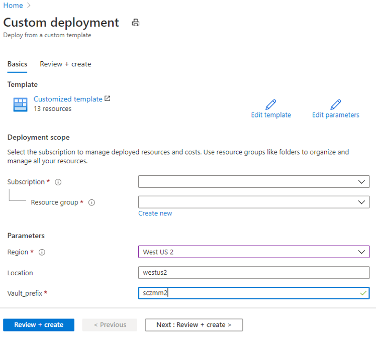
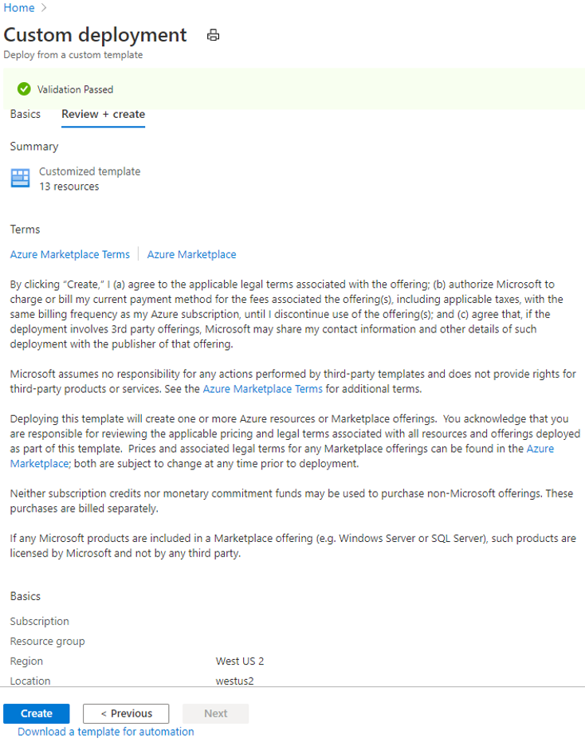
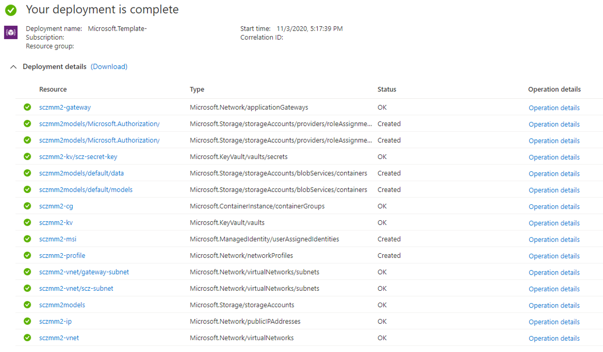

# Provision a new secured locker

A secured AI model locker relies on a number of Azure resources to operate (please see [server topology](server-topology.md) for more details). To provision your server instance on Azure, follow the steps outlined below.  

## Step 1. Provision SantaCruz AI/ML model and sensor data protection solution (TODO: change azuredeploy.json file location to the official path)

1. Press this button to deploy the SantaCruz AI/ML model and sensor data protection solution to your Azure public cloud:

    [](https://portal.azure.com/#create/Microsoft.Template/uri/https%3A%2F%2Fraw.githubusercontent.com%2FJiaBaoxi%2FPublicShare%2Fmaster%2Fazuredeploy.json)

    The button will redirect you to the **Custom deployment** page in the Azure portal:

    

1. To deploy the solution in the cloud, enter the following parameters and click **Review + create**:

    - <strong>Subscription</strong>: the subscription in which to create the solution.

    - <strong>Resource Group</strong>: unique name of a new resource group to host the Santa Cruz AI/ML model and sensor data protection solution components.

    - <strong>Region</strong>: Azure region in which the solution will be deployed.

    - <strong>Location</strong>: location within the region.

    - <strong>Vault_prefix</strong>: prefix to attach to new resource names.

1. On the next page, click <strong>Create</strong> after agreeing to the terms and conditions.

    

    The deployment may take several minutes to complete and should result in creation of Azure resources within the specified resource group.

    

## Step 2: Update deployment using PowerShell script

### Prerequisites

We offer a PowerShell script for server deployment. To run the script, you must install the following:

- [Git Bash](https://git-scm.com/downloads)
- [PowerShell](https://docs.microsoft.com/en-us/powershell/scripting/install/installing-powershell?view=powershell-7)
- [Azure PowerShell Module](https://docs.microsoft.com/en-us/powershell/azure/install-az-ps?view=azps-4.6.1)

### Update server access

1. Open Git Bash and enter the following to clone the Project Santa Cruz GitHub repository:

    ```
   git clone https://github.com/microsoft/Project-Santa-Cruz-Preview.git
   ```

1. Launch PowerShell.

1. Run the device_identity script in the PowerShell terminal:

   ```
   cd "Project-Santa-Cruz-Preview/Sample-Scripts-and-Notebooks/Official/Secured Locker/deployment"
   ./device_identity.ps1 -vaultName <Azure Key Vault instance name generated by provision step> -subscription <Azure subscription name or id>
   ```
    
    > **NOTE**: your Key Vault instance will be [Vault_prefix]-kv, where [Vault_prefix] is the prefix parameter chosen during the custom deployment creation above.

   For example, the following command generates a new service principal and grants it access to the ```scz-mm1-kv``` key vault instance under the ```my-subscription``` subscription:

   ```
    ./device_identity.ps1 -vaultName scz-mm1-kv -subscription my-subscription
    ```

1. The script will open a web browser. Enter your Azure account login details when prompted.

1. Once the script finishes, it will output the service principal that has been granted access to the Azure Key Vault service:

   ```
   Santa Cruz Secred Model Management server is provisioned at:  ...
   Service Principal Client ID:     3f38...
   Service Principal Tenant ID:     72f9...
   Service Principal Client Secret: bf49...
   ```

    > **NOTE**: Write down the service principal credentials (Client ID, Tenant ID, Client Secret). You'll use it to log in to the Santa Cruz server later.

## Step 3: Add TLS certificate to gateway

A secured AI model locker is deployed with an [Azure Application Gateway](https://docs.microsoft.com/en-us/azure/application-gateway/overview) as its entry point. By default, the gateway is configured to serve an HTTP endpoint only. As we may need to pass the decryption key to the client-side containers, you should enable HTTPS on the Application Gateway instance with a proper certificate that has the subject matching with the gateway’s FQDN.

The SantaCruz Secure AI solution offers a ```config_certificate.ps1``` PowerShell script to assist you with configuring the certificate. If you don't have a certificate, the script generates a self-signed certificate (for testing purposes only). You'll need ```openssl``` to generate the certificate.

>**NOTE**: The easiest way to get ```openssl``` on Windows 10 is to install [Git Bash](https://git-scm.com/downloads), which comes with ```openssl``` under folder ```c:\Program Files\Git\usr\bin```. The script assumes you've added openssl to your PATH variable.

1. Launch PowerShell as an Administrator.

> **NOTE**: we need administrative privilege for key operations while creating the self-signed certificate.

1. Run the config_certificate script:

   ```
   ./config_certificate.ps1 -subscription <Azure subscription name or id> -prefix <resource prefix used in provision step> -resourceGroup <resource group of your deployment> -location <location of your deployment>
   ```

   >**NOTE**: Make sure ```location```, ```resourceGroup```, ```subscription``` and ```prefix``` match the parameters selected earlier when creating your custom deployment.

   For example, the following command updates your locker deployment with a self-signed certificate.

   ```
   ./config_certificate.ps1 -subscription my-subscription -prefix scz-mm1  -resourceGroup scz-mm -location westus2
   ```

   To use your own certificate, run the script with a ```certFile``` parameter pointing to your ```.pfx``` file and ```certPassword``` parameter with your private key password. For example:

   ```
   ./config_certificate.ps1 -subscription my-subscription -prefix scz-mm1  -resourceGroup scz-mm  -location westus2 -certFile .\appgwcert.pfx -certPassword abc
   ```

1. When prompted (only when you use auto-generated certificate), enter a password for your certificate private key.

1. Once the script finishes, your Application Gateway will be configured to use HTTPS (via port 443) instead of HTTP (via port 5000).

   > **NOTE**: Write down the server URL. You'll use it to access the server later.

## Step 4: Install Python SDK (TBD)

## Step 5: Clean up resources

Other Santa Cruz Secure AI Lifecycle features build upon this quickstart. If you plan to continue with subsequent quickstarts and tutorials, you may wish to leave these resources in place.

When you are ready to clean up resources, please ensure you have decrypted any data and/or AI/ML models prior to deletion. Afterward, delete the resource group, which deletes the Santa Cruz Secure AI Lifecycle solution components.
