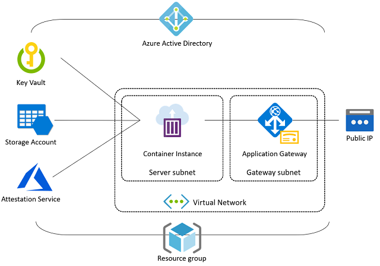

# Server Topology

The Azure-Percept-SMM server process itself runs as a single, stateless Docker container. This allows the server to be deployed and scaled on any hosting platforms where Docker containers are supported, including (but certainly not limited to): [Azure Container Instances](https://azure.microsoft.com/en-us/services/container-instances/), [Azure Functions](https://azure.microsoft.com/en-us/services/functions/), [Azure Kubernetes Services](https://azure.microsoft.com/en-us/services/kubernetes-service), and other [Kubernetes](https://kubernetes.io/) clusters.

However, the Azure-Percept-SMM server relies on a few Azure services to deliver required capabilities such as key management, file management, authentication, attestation, and more. The following diagram illustrates how a Azure-Percept-SMM server, which is deployed as an ACI instance, interacts with other Azure services.

* **Application Gateway**
  
  Azure-Percept-SMM uses Application Gateway as the front door of the system. The gateway manages service certificate and does TLS termination (though end-to-end TLS is also possible).
  
* **Azure Active Directory**
  
  Azure-Percept-SMM uses [Azure AD service principals](https://docs.microsoft.com/en-us/azure/active-directory/develop/app-objects-and-service-principals) for authentication and uses Azure AD to reinforce role-based access control (RBAC). Azure-Percept-SMM also uses [managed identities](https://docs.microsoft.com/en-us/azure/active-directory/managed-identities-azure-resources/overview) where appropriate to establish cross-service security contexts.

* **Container Instance**

    Because the Azure-Percept-SMM server is a lightweight, stateless web service, ACI (Azure Container Instances) is a nice choice to host Azure-Percept-SMM instances with minimum cost. However, you can certainly choose to host the Azure-Percept-SMM container in other environments (such as your existing Kubernetes clusters). By default, the Azure-Percept-SMM server listens to port 5000 over HTTPS protocol.

* **Key Vault**
  
    Azure-Percept-SMM uses Azure Key Vault to manage encryption/decryption keys. Azure-Percept-SMM generates a new key for each model version so that the key only works for a specific version of a specific AI model. SCZ-MM also uses Azure Key Vault to manage the service certificate that is associated with the Application Gateway instance.

* **Public IP**
  
    Azure-Percept-SMM associates a public IP to the Application Gateway instance and generates a DNS label, which you can use as the subject of your service certificate.

* **Storage Account**

    Azure-Percept-SMM stores encrypted AI models and training data in Azure Storage containers.

* **Virtual Network**

    The Azure-Percept-SMM server instance is deployed on a dedicated subnet of a virtual network, to which the Application Gateway is deployed (in its own subnet). The network security group (NSG) blocks all network traffic other than the inbounding 433 port for HTTPS connections.